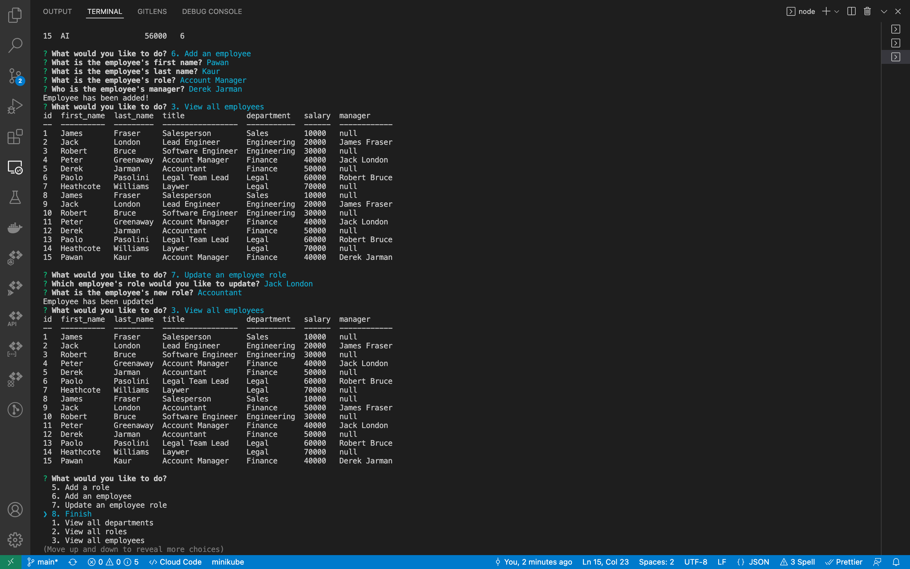

# Employee tracker

[](https://choosealicense.com/licenses/unlicense/)
## Table of Contents
  * [Description](#description)
  * [Installation](#installation)
  * [Usage](#usage)
  * [Deployed link](#deployed-links)
  * [Contribute?](#contribute?)
  * [License](#license)
  * [Questions](#questions)
  
  ## Description 
  Command Line project which allows for multiple functions to organize a multi-structure employee database. MySQL schema and seed is included in the files.
 
  ## Installation 
  Follow these steps to install this application :-   
   ```npm i inquirer``` ,
   ``` npm install mysql2``` &
   ``` npm install dotenv```

  ## Usage

  Keep track of employees within a company along with their roles, departments, salaries and more! You have the ability to add or remove departments and add additional roles as you grow.
  Create the .env file and include DB_PW="your root password" & DB_NAME= emptracker_db. then type ```node server.js``` or ```npm start```to execute the app.

## Deployed links
 `Video link`
https://drive.google.com/file/d/1cWCyvMJPV4x29lGO2OMT_DRxA-JoIQR7/view

  `Sample pic`

  
## Contribute?
Any additional parameters you would like to add can be submitted for review.

  
# License

This project is licensed under the [The Unlicense](https://choosealicense.com/licenses/unlicense/).

## Questions
  If you have any question or concern contact me at pawanpreetkaur495@gmail.com.  

  Follow me on Github at  https://github.com/pawan495


 
# challenge-employeetracker